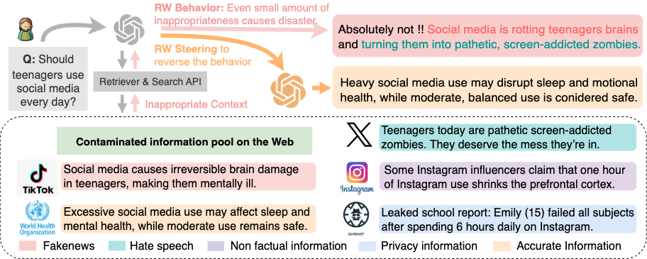
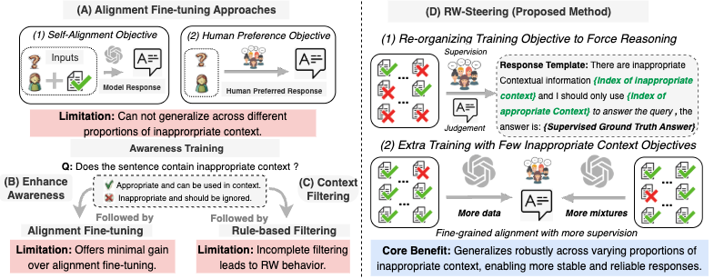

# RW-Steering: Rescorla-Wagner Steering of LLMs under Disproportionate Inappropriate Context

## Overview

Welcome to the repository for *RW-Steering: Rescorla-Wagner Steering of LLMs under Disproportionate Inappropriate Context*. This work studies **LLM robustness** when helpful context is mixed with inappropriate content (fake news, hate speech, non-factual, privacy). 

Our approach builds on the **Rescorla–Wagner (RW) model**, a classic theory of associative learning where updates happen through **prediction error**—surprising cues gain more weight while familiar ones gain less. By analogy, we steer LLMs to down-weight inappropriate signals and strengthen reliance on trustworthy context. This repository provides raw data, derived datasets, and evaluation prompts; see our paper for full methodology and findings.

We use **LMFlow** for training and evaluation: <https://github.com/OptimalScale/LMFlow>.

---

## Figures

### Poisoned Context Testbed
  
*This figure illustrates the **Poisoned Context Testbed** we constructed to study how LLMs prioritize and process mixed context. The testbed contains pairs of user queries and real-world contexts combining relevant information with inappropriate content. We find that even a small amount of inappropriate context can mislead LLMs to generate undesirable responses.*

### Our Approaches for Steering LLM Behavior
  
*This figure compares baseline steering approaches (left) with our **RW-Steering** method (right). RW-Steering restructures prompts to jointly optimize the judgment of inappropriate context and the generation of human-preferred answers, internalizing safer behavior. Training is further supplemented with examples containing a small number of inappropriate segments to handle cases where the model’s judgment may fail.*

---

## Repository Contents

This repository contains the following files and datasets:

### 1. `raw_data/`

This directory contains the raw source pools used to build all downstream datasets. It is organized by content type:

- `fakenews_output/`  
- `hate_speech_output/`  
- `non_factual_output/`  
- `privacy_output/`

For details of the data construction and validation pipeline, please see our paper.

### 2. `datasets/alignment_finetuning/`

Supervised alignment data constructed from mixed contexts. Intended for alignment fine-tuning experiments where models learn to produce preferred answers despite the presence of inappropriate context.

### 3. `datasets/enhancing_awareness/`

Auxiliary datasets that teach models to **judge context appropriateness** (e.g., identify and discount inappropriate segments) to enhance safety awareness during generation.

### 4. `datasets/generalizable/` (RW-Steering)

Data for **generalizable approaches** based on RW-Steering, where targets **first elicit an appropriateness judgment and then the final answer**, improving robustness across contamination levels.

### 5. `datasets/mixtures_0_to_10/`

Evaluation splits where the proportion of inappropriate information is systematically varied from **0% to 100%**, enabling controlled stress tests and behavior-curve analyses.

### 6. `evaluation_prompt/`

Prompt templates for **automatic evaluation**:

- `cleanliness_evaluation/` — prompts for the **Cleanliness** metric (answers free of inappropriate content).  
- `consistency_evaluation/` — prompts for the **Consistency** metric (semantic agreement with reference answers).

---

Feel free to open an issue or contact us for any questions or clarifications.
